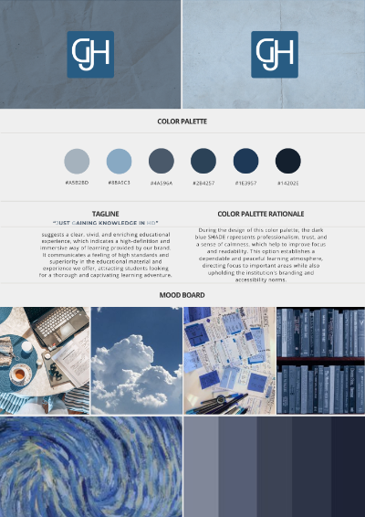

# Project Overview [Episteme]

#### Members
    S10262576 | Ggwendolynn Lee Rasni
    S10262569 | Jovan Tan Hao
    S10262840 | Daphne Cheng Pei En
    S10262621 | Tan Han Yan

> [!NOTE]
> Topic 2: Social Impact

Episteme [ep-is-teem] | knowledge; specifically : intellectually certain knowledge.

Tagline: Just Gaining Knowledge in HD

Episteme is a cutting-edge virtual learning tool created to enable individuals in their quest for education and career advancement. Episteme offers a variety of expert-led courses and tutorials in business, technology, creative fields, and personal development, creating a dynamic learning experience designed for today's learner. Our platform prioritizes accessibility and excellence, providing users with the necessary skills and insights to succeed in today's competitive environment. Episteme empowers individuals to realize their complete potential and reach their professional goals with a carefully crafted curriculum and engaging learning resources.

## Features

#### ***S10262576 | Ggwendolynn Lee Rasni | Instructor***
    1. POST - Create New Content/Playlist.
    2. DELETE - Delete Playlist.

#### ***S10262569 | Jovan Tan Hao | Examiner***
    1. GET - Recently did Quiz.
    2. POST - Create Quiz.

#### ***S10262840 | Daphne Cheng Pei En | User/Member***
    1. GET - Retrieve User's Info for Profile.
    2. POST - Create User's Profile.

#### ***S10262621 | Tan Han Yan |  Customer Service Staff***
    1. GET - Retrieve customer feedback. 
    2. DELETE - Delete Feedback. 

## Technologies Used

- [Visual Code Studio Software](https://visualstudio.microsoft.com)
    - Visual Code Studio is used to help me code out my entire website from scratch.
- [Adobe XD](https://www.adobe.com/sg/products/xd/learn/get-started/what-is-adobe-xd-used-for.html)
    - Adobe XD is used to help me design out my wireframes to showcase what my website is suppose to look like.
- [HTML](https://www.w3schools.com/whatis/whatis_html.asp)
    - HTML is used to structure the web pages and its' contents.
- [CSS](https://www.w3schools.com/css/css_intro.asp#:~:text=CSS%20is%20used%20to%20define,different%20devices%20and%20screen%20sizes.)
    - CSS is used to define styles for your web pages, including the design, layout and variations in display for different devices and screen sizes.
- [JavaScript](https://developer.mozilla.org/en-US/docs/Learn/JavaScript/First_steps/What_is_JavaScript)
    -  Javascript is used for to allow me to implement complex features on my web pages to make the website more functional.
- [ExpressNode.js]()
    - Lorem Ipsum
- [SMSS](https://learn.microsoft.com/en-us/sql/ssms/sql-server-management-studio-ssms?view=sql-server-ver16)
    - SMSS is used to...

## Testing
> [!NOTE]
> TBC

- 

## Credits

Content/Media:
- [Logos]
    - Custom made using Canva/Adobe Photoshop.
- [Icons](https://boxicons.com/?query=)
    - Majority icons are used from boxicons.

Coding Help:
- [w3schools](https://www.w3schools.com)
    - Front-End Coding Help.
- [ExpressNode.js](https://expressjs.com)
    - Back-End Coding Help.
